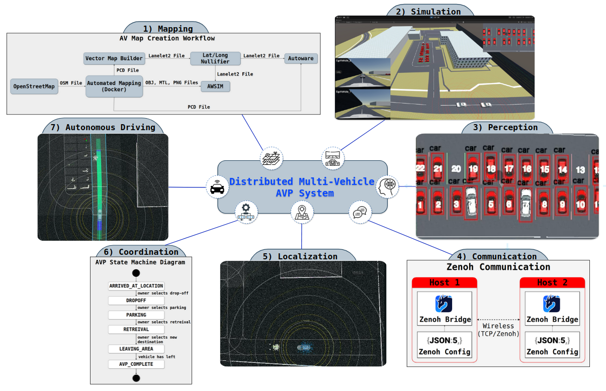
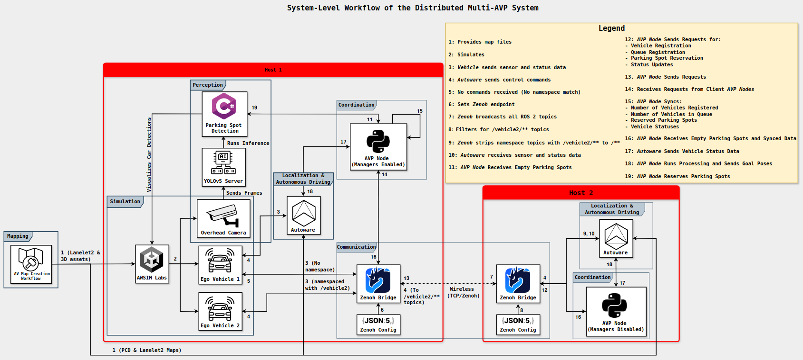
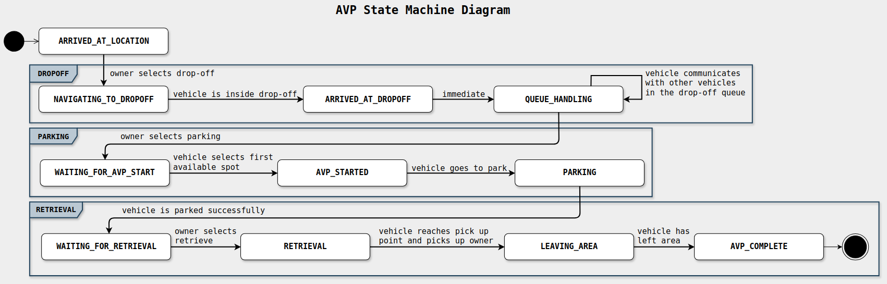

# System Architecture

The Autonomous Valet Parking (AVP) system is built as an extension of the [DMAVA](https://github.com/av-anon/dmava-anon).
It relies on the same architecture, but with added orchestration logic, manager nodes, and namespace handling to enable multi-vehicle parking coordination.

## DMV-AVP Architecture

---

## System Workflow

---

## AVP State Machine Flow

---

## Software Stack and Version Overview

| **Component**              | **Name**                                | **Version / Branch**                               |
|----------------------------|-----------------------------------------|----------------------------------------------------|
| Operating System           | Ubuntu                                  | 22.04 LTS                                          |
| ROS 2 Distribution         | ROS 2                                   | Humble Hawksbill                                   |
| Autonomy Stack             | Autoware Universe                       | release/2024.11 (modified)                         |
| Simulation Engine          | AWSIM Labs                              | main (modified)                                    |
| Middleware Bridge          | Zenoh Bridge for ROS 2                  | `release/1.4.0`                                    |
| Parking Spot Detection     | YOLO                                    | v5                                                 |
| AVP Orchestration Module   | Multi-Vehicle AVP Node (Custom)         | custom                                             | 

## Host Roles

- **Host 1 (Nitro PC)**:

    - AWSIM Labs simulation (Unity-based)
    - YOLOv5-based parking spot detection server
    - Autoware (vehicle 1 stack)
    - AVP orchestration node (with **manager nodes** enabled)
    - Zenoh Bridge (in router mode)

- **Host 2 (ROG Laptop)**:

    - Autoware (vehicle 2 stack, with `/vehicle2` namespace)
    - A second AVP orchestration node (**no managers**, namespace-aware)
    - Zenoh Bridge (in client mode)

---

**Next Steps:** Proceed to [Software Setup](../SoftwareSetup/index.md).
